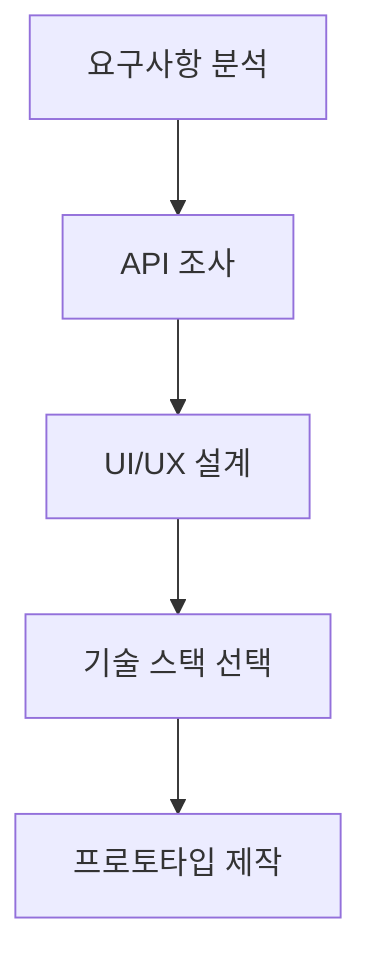

# 🌟 공공데이터 통합 플랫폼

> **한국 공공데이터포털(data.go.kr) API를 활용한 통합 정보 서비스**

<p align="center">
  <a href="#-설치-및-실행">🚀 설치</a> •
  <a href="#-api-설정">🔑 API 설정</a> •
  <a href="#-스크린샷">📸 스크린샷</a> •
  <a href="#-기여하기">🤝 기여</a>
</p>

---

## 📋 목차

- [소개](#-소개)
- [주요 기능](#-주요-기능)
- [기술 스택](#-기술-스택)
- [프로젝트 구조](#-프로젝트-구조)
- [개발 과정](#-개발-과정)
- [설치 및 실행](#-설치-및-실행)
- [API 설정](#-api-설정)
- [사용법](#-사용법)
- [스크린샷](#-스크린샷)
- [성능 최적화](#-성능-최적화)
- [접근성](#-접근성)
- [기여하기](#-기여하기)
- [문제 해결](#-문제-해결)
- [라이선스](#-라이선스)
- [연락처](#-연락처)

## 🚀 소개

공공데이터 통합 플랫폼은 한국의 공공데이터포털에서 제공하는 다양한 API를 활용하여 시민들에게 필요한 정보를 통합적으로 제공하는 웹 플랫폼입니다. 

날씨, 부동산, 관광 정보를 한 곳에서 편리하게 조회할 수 있으며, 모든 기기에서 최적화된 사용자 경험을 제공합니다.

### ✨ 특징

- 🌤️ **실시간 날씨 정보** - 기상청 API를 통한 상세 날씨 예보
- 🏢 **부동산 실거래가** - 서울시 부동산 시장 분석
- 🗺️ **관광지 날씨** - 여행 계획을 위한 관광기후지수
- 📱 **완벽한 반응형** - 모바일부터 데스크톱까지
- 🎨 **모던 UI/UX** - 프로페셔널하고 직관적인 디자인
- ⚡ **고성능** - 최적화된 로딩과 부드러운 애니메이션

## 🎯 주요 기능

### 1. 🌤️ 실시간 날씨 정보
- **기상청 단기예보 API** 연동
- 시간별 기온/습도 변화 차트
- 풍향, 풍속, 강수량 실시간 모니터링
- 격자 좌표 기반 정확한 지역별 예보

### 2. 🏢 부동산 실거래가 분석
- **서울시 부동산 실거래가 API** 연동
- 자치구별/월별 거래량 통계
- 평균/최고/최저 거래금액 분석
- 아파트, 오피스텔, 연립다세대 필터링
- 인터랙티브 차트와 테이블

### 3. 🗺️ 관광지 날씨 서비스
- **관광지 날씨 정보 API** 연동
- 지역별 관광기후지수 제공
- 활동별 추천도 분석 (관광, 등산, 해변, 축제)
- 주간 날씨 전망
- 월별 관광기후지수 추이

### 4. 🎨 사용자 경험
- **햄버거 메뉴** - 모바일 최적화 네비게이션
- **터치 제스처** - 스와이프 사이드바 제어
- **키보드 네비게이션** - 접근성 지원
- **자동 새로고침** - 5분마다 데이터 업데이트
- **PWA 지원** - 앱처럼 설치 가능

## 🛠 기술 스택

### Frontend
- **HTML5** - 시맨틱 마크업
- **CSS3** - Grid, Flexbox, CSS Variables
- **JavaScript (ES6+)** - 모던 JavaScript
- **Chart.js** - 데이터 시각화
- **Web APIs** - Fetch, Service Worker, Local Storage

### Design
- **Inter Font** - 모던 타이포그래피
- **CSS Grid & Flexbox** - 반응형 레이아웃
- **CSS Custom Properties** - 테마 시스템
- **Backdrop Filter** - 글래스모피즘 효과

### APIs
- **기상청 단기예보 조회서비스**
- **서울시 부동산 실거래가 정보**  
- **관광지 날씨 정보 서비스**

## 📁 프로젝트 구조

```
public-data-platform/
├── index.html              # 메인 HTML 파일
├── api.html               # API 통합 플랫폼 (현재 파일)
├── README.md              # 프로젝트 문서
├── LICENSE                # 라이선스 파일
├── screenshots/           # 스크린샷 폴더
│   ├── main-banner.png
│   ├── desktop-weather.png
│   ├── desktop-realestate.png
│   ├── desktop-tourism.png
│   ├── mobile-menu.png
│   ├── mobile-weather.png
│   ├── mobile-realestate.png
│   ├── mobile-tourism.png
│   ├── tablet-view.png
│   ├── charts-showcase.png
│   ├── responsive-demo.gif
│   └── features-overview.png
├── assets/                # 정적 파일
│   ├── css/
│   ├── js/
│   └── icons/
└── docs/                  # 추가 문서
    ├── API_GUIDE.md
    ├── DEPLOYMENT.md
    └── CONTRIBUTING.md
```

## 🔧 개발 과정

### 1. 기획 및 설계 단계


#### 요구사항 정의
- 공공데이터 3개 이상 통합
- 모바일 우선 반응형 디자인
- 실시간 데이터 시각화
- 직관적인 사용자 인터페이스

### 2. UI/UX 디자인 과정

#### 디자인 시스템 구축
```css
:root {
    --primary-gradient: linear-gradient(135deg, #667eea 0%, #764ba2 100%);
    --secondary-gradient: linear-gradient(135deg, #f093fb 0%, #f5576c 100%);
    --success-gradient: linear-gradient(135deg, #4facfe 0%, #00f2fe 100%);
    /* ... 더 많은 색상 변수 */
}
```

#### 반응형 브레이크포인트
```css
/* 태블릿 */
@media (max-width: 1024px) { /* ... */ }

/* 모바일 */
@media (max-width: 768px) { /* ... */ }

/* 소형 모바일 */
@media (max-width: 480px) { /* ... */ }
```

### 3. 컴포넌트 개발

#### 네비게이션 시스템
```javascript
function initNavigation() {
    const hamburger = document.getElementById('hamburger');
    const sidebar = document.getElementById('sidebar');
    // 햄버거 메뉴 토글 로직
    // 모바일 메뉴 제어 로직
    // 키보드 네비게이션 지원
}
```

#### 데이터 시각화
```javascript
function createWeatherCharts() {
    // Chart.js를 활용한 온도 차트
    // 습도 및 풍속 차트
    // 반응형 차트 옵션
}
```

### 4. API 통합 과정

#### 샘플 데이터 구조
```javascript
const sampleWeatherData = {
    T1H: 22,    // 기온
    RN1: 0,     // 1시간 강수량
    UUU: 2.1,   // 동서바람성분
    VVV: -1.3,  // 남북바람성분
    REH: 65,    // 습도
    PTY: 0,     // 강수형태
    VEC: 310,   // 풍향
    WSD: 2.5    // 풍속
};
```

### 5. 성능 최적화 과정

#### 디바운싱 적용
```javascript
const debouncedScrollHandler = debounce(() => {
    // 스크롤 이벤트 최적화
}, 10);
```

#### 차트 메모리 관리
```javascript
if (charts.tempChart) charts.tempChart.destroy();
charts.tempChart = new Chart(/* 새 차트 생성 */);
```

## 🚀 설치 및 실행

### 방법 1: GitHub Pages로 배포

1. **저장소 Fork 및 Clone**
```bash
git clone https://github.com/your-username/public-data-platform.git
cd public-data-platform
```

2. **GitHub Pages 설정**
- Repository Settings → Pages
- Source: Deploy from a branch
- Branch: main / (root)

### 방법 2: 로컬 개발 환경

#### Python 사용
```bash
# Python 3
python -m http.server 8000

# 브라우저에서 확인
open http://localhost:8000
```

#### Node.js 사용
```bash
# http-server 설치
npm install -g http-server

# 서버 실행
http-server -p 8000

# 브라우저에서 확인
open http://localhost:8000
```

#### Live Server (VSCode 추천)
```bash
# VSCode 확장프로그램 설치
code --install-extension ritwickdey.LiveServer

# 또는 VSCode 내에서 설치: Ctrl+Shift+X → "Live Server" 검색
```

### 방법 3: Docker 사용
```dockerfile
# Dockerfile
FROM nginx:alpine
COPY . /usr/share/nginx/html
EXPOSE 80
CMD ["nginx", "-g", "daemon off;"]
```

```bash
# Docker 이미지 빌드 및 실행
docker build -t public-data-platform .
docker run -p 8080:80 public-data-platform
```

## 🔑 API 설정

실제 공공데이터를 연동하려면 API 인증키가 필요합니다.

### 1. 공공데이터포털 가입 및 API 신청

#### 🌤️ 기상청 단기예보 API
1. [공공데이터포털](https://www.data.go.kr) 회원가입
2. "기상청_단기예보 ((구)_동네예보) 조회서비스" 검색
3. 활용신청 → 승인 대기 (보통 1-2시간) → 인증키 발급
4. API 문서 확인: 요청 변수, 응답 형식 등

#### 🏢 서울시 부동산 API  
1. [서울열린데이터광장](https://data.seoul.go.kr) 회원가입
2. "서울시 부동산 실거래가 정보" API 신청
3. 인증키 발급 (즉시)
4. API 테스트: Postman 또는 브라우저에서 확인

#### 🗺️ 관광지 날씨 API
1. [공공데이터포털](https://www.data.go.kr)에서
2. "관광지 날씨 정보" 검색 및 신청
3. 인증키 발급
4. 샘플 요청/응답 테스트

### 2. 개발 환경 설정

#### config.js 파일 생성
```javascript
// config/api-config.js
const API_CONFIG = {
    WEATHER: {
        key: 'YOUR_WEATHER_API_KEY',
        baseUrl: 'http://apis.data.go.kr/1360000/VilageFcstInfoService_2.0',
        endpoints: {
            current: '/getUltraSrtNcst',
            forecast: '/getUltraSrtFcst'
        }
    },
    REALESTATE: {
        key: 'YOUR_REALESTATE_API_KEY',
        baseUrl: 'http://openapi.seoul.go.kr:8088',
        format: 'json'
    },
    TOURISM: {
        key: 'YOUR_TOURISM_API_KEY',  
        baseUrl: 'http://apis.data.go.kr/1360000/TourStnInfoService'
    }
};
```

### 3. CORS 문제 해결

#### 옵션 1: 백엔드 프록시 서버 (Express.js)
```javascript
// server.js
const express = require('express');
const cors = require('cors');
const app = express();

app.use(cors());

// 날씨 API 프록시
app.get('/api/weather', async (req, res) => {
    const { nx, ny } = req.query;
    const apiUrl = `${WEATHER_API_URL}?serviceKey=${API_KEY}&nx=${nx}&ny=${ny}`;
    
    try {
        const response = await fetch(apiUrl);
        const data = await response.json();
        res.json(data);
    } catch (error) {
        res.status(500).json({ error: error.message });
    }
});

app.listen(3000, () => {
    console.log('프록시 서버가 3000번 포트에서 실행중입니다.');
});
```

#### 옵션 2: Netlify Functions
```javascript
// netlify/functions/weather.js
exports.handler = async (event, context) => {
    const { nx, ny } = event.queryStringParameters;
    
    const apiUrl = `${process.env.WEATHER_API_URL}?serviceKey=${process.env.WEATHER_API_KEY}&nx=${nx}&ny=${ny}`;
    
    try {
        const response = await fetch(apiUrl);
        const data = await response.json();
        
        return {
            statusCode: 200,
            headers: {
                "Access-Control-Allow-Origin": "*",
                "Access-Control-Allow-Headers": "Content-Type"
            },
            body: JSON.stringify(data)
        };
    } catch (error) {
        return {
            statusCode: 500,
            body: JSON.stringify({ error: error.message })
        };
    }
};
```

#### 옵션 3: Vercel API Routes
```javascript
// api/weather.js
export default async function handler(req, res) {
    const { nx, ny } = req.query;
    
    const apiUrl = `${process.env.WEATHER_API_URL}?serviceKey=${process.env.WEATHER_API_KEY}&nx=${nx}&ny=${ny}`;
    
    try {
        const response = await fetch(apiUrl);
        const data = await response.json();
        
        res.setHeader('Access-Control-Allow-Origin', '*');
        res.status(200).json(data);
    } catch (error) {
        res.status(500).json({ error: error.message });
    }
}
```

## 💡 사용법

### 기본 사용법

1. **메뉴 네비게이션**
   - 사이드바에서 원하는 서비스 선택
   - 모바일에서는 햄버거 메뉴 사용

2. **날씨 조회**
   - 격자 X, Y 좌표 입력 (예: X=60, Y=127)
   - "날씨 조회" 버튼 클릭
   - 실시간 날씨 정보 및 차트 확인

3. **부동산 조회**
   - 자치구, 물건구분, 연도 선택
   - "조회" 버튼 클릭
   - 통계 및 상세 거래 정보 확인

4. **관광지 날씨**
   - 관광지역, 계절, 활동유형 선택
   - "조회" 버튼 클릭
   - 관광기후지수 및 활동 추천도 확인

### 고급 사용법

#### 키보드 단축키
- `Esc` - 모바일 메뉴 닫기
- `↑/↓` - 메뉴 항목 이동
- `Tab` - 포커스 이동
- `Enter` - 선택된 메뉴 활성화

#### 터치 제스처 (모바일)
- **왼쪽 스와이프** - 사이드바 닫기
- **오른쪽 스와이프** - 사이드바 열기
- **길게 누르기** - 상세 정보 표시

## 📸 스크린샷

### 🖥️ 데스크톱 화면

#### 날씨 정보 대시보드
<p align="center">
  
</p>

*실시간 기온, 습도, 풍속 정보와 시간별 차트를 한눈에 확인*

#### 부동산 실거래가 분석
<p align="center">
  
</p>

*서울시 자치구별 부동산 거래 현황과 통계*

#### 관광지 날씨 서비스
<p align="center">
  
</p>

*여행지별 관광기후지수와 활동 추천도*

## ⚡ 성능 최적화

### 1. 렌더링 최적화
```javascript
// 디바운싱으로 스크롤 이벤트 최적화
const debouncedScrollHandler = debounce(() => {
    const navbar = document.getElementById('navbar');
    if (window.scrollY > 10) {
        navbar.classList.add('scrolled');
    } else {
        navbar.classList.remove('scrolled');
    }
}, 10);
```

### 2. 메모리 관리
```javascript
// 차트 인스턴스 정리
function destroyChart(chartInstance) {
    if (chartInstance) {
        chartInstance.destroy();
        chartInstance = null;
    }
}
```

### 3. 이미지 최적화
```css
/* CSS로 이미지 지연 로딩 */
.lazy-image {
    opacity: 0;
    transition: opacity 0.3s;
}

.lazy-image.loaded {
    opacity: 1;
}
```

### 4. 번들 최적화
- CSS 변수를 활용한 테마 시스템
- 불필요한 JavaScript 제거
- 이미지 압축 및 WebP 형식 사용

## ♿ 접근성

### ARIA 속성
```html
<nav aria-label="주 내비게이션">
<button aria-expanded="false" aria-controls="sidebar">메뉴</button>
<main role="main" aria-label="메인 콘텐츠">
```

### 키보드 네비게이션
```javascript
// 포커스 트랩 구현
document.addEventListener('keydown', function(event) {
    if (event.key === 'Tab') {
        handleFocusTrap(event);
    }
});
```

### 색상 접근성
- WCAG 2.1 AA 준수
- 명도 대비 4.5:1 이상
- 색각 이상자를 위한 색상 선택

## 🤝 기여하기

### 기여 과정

1. **이슈 생성**
   - 버그 리포트나 기능 요청 이슈 생성
   - 템플릿을 사용하여 상세 정보 제공

2. **개발 환경 설정**
```bash
git clone https://github.com/your-username/public-data-platform.git
cd public-data-platform
git checkout -b feature/your-feature-name
```

3. **코드 작성 및 테스트**
```bash
# 개발 서버 실행
python -m http.server 8000

# 다양한 브라우저에서 테스트
# 모바일 시뮬레이터에서 확인
```

4. **Pull Request 생성**
   - 명확한 PR 제목과 설명
   - 스크린샷 또는 GIF 첨부
   - 체크리스트 완료

### 코딩 컨벤션

#### JavaScript
```javascript
// ✅ 권장
function getData() {
    return fetch('/api/data')
        .then(response => response.json())
        .then(data => {
            console.log('데이터 로드 성공:', data);
            return data;
        })
        .catch(error => {
            console.error('데이터 로드 실패:', error);
            throw error;
        });
}

// ❌ 비권장
function getData(){return fetch('/api/data').then(response=>response.json()).catch(error=>console.error(error));}
```

#### CSS
```css
/* ✅ 권장 - CSS 변수 사용 */
.card {
    background: var(--bg-primary);
    border-radius: var(--border-radius);
    padding: var(--spacing-lg);
    box-shadow: var(--shadow-md);
}

/* ❌ 비권장 - 하드코딩된 값 */
.card {
    background: #ffffff;
    border-radius: 16px;
    padding: 2rem;
    box-shadow: 0 4px 6px rgba(0, 0, 0, 0.1);
}
```

## 🔧 문제 해결

### 자주 발생하는 문제들

#### 1. CORS 에러
```
Access to fetch at 'api-url' from origin 'localhost:8000' has been blocked by CORS policy
```

**해결방법:**
- 백엔드 프록시 서버 사용
- Netlify/Vercel Functions 활용
- 브라우저 확장프로그램 사용 (개발시에만)

#### 2. Chart.js 렌더링 문제
```javascript
// 해결방법: 컨테이너 크기 확인 후 차트 생성
function createChart() {
    const container = document.getElementById('chartContainer');
    if (container.offsetWidth === 0) {
        setTimeout(createChart, 100);
        return;
    }
    // 차트 생성 로직
}
```

#### 3. 모바일에서 터치 이벤트 문제
```javascript
// 패시브 리스너 사용
document.addEventListener('touchstart', handleTouch, { passive: true });
```

### 디버깅 팁

#### 브라우저 개발자 도구 활용
1. Network 탭에서 API 요청 확인
2. Console에서 JavaScript 오류 확인
3. Elements 탭에서 CSS 스타일 확인
4. Lighthouse로 성능 측정

#### 모바일 디버깅
```javascript
// 모바일에서 콘솔 로그 확인
function mobileDebug(message) {
    const debugDiv = document.getElementById('debug');
    if (debugDiv) {
        debugDiv.innerHTML += `<p>${new Date().toISOString()}: ${message}</p>`;
    }
}
```

## 📄 라이선스

이 프로젝트는 **MIT 라이선스**를 따릅니다.

```
MIT License

Copyright (c) 2024 공공데이터 통합 플랫폼

Permission is hereby granted, free of charge, to any person obtaining a copy
of this software and associated documentation files (the "Software"), to deal
in the Software without restriction, including without limitation the rights
to use, copy, modify, merge, publish, distribute, sublicense, and/or sell
copies of the Software...
```

### 🙏 감사의 말

#### 오픈소스 라이브러리
- [Chart.js](https://www.chartjs.org/) - 데이터 시각화
- [Inter Font](https://rsms.me/inter/) - 타이포그래피

#### 데이터 제공
- [공공데이터포털](https://www.data.go.kr) - 기상청, 관광 데이터
- [서울열린데이터광장](https://data.seoul.go.kr) - 부동산 데이터

#### 영감을 준 프로젝트들
- [Material Design](https://material.io)
- [Apple Human Interface Guidelines](https://developer.apple.com/design/)

---

## 📞 연락처

- **개발자**: Kim San / Mipotapota@gmail.com
- **GitHub**: https://github.com/mipotapota

---

<p align="center">
  <sub>⭐ 이 프로젝트가 유용했다면 Star를 눌러주세요! ⭐</sub>
</p>

<p align="center">
  
  
  
</p>

<p align="center">
  
  
  
</p>

---

## 🔄 업데이트 로그

### v1.2.0 (계획중 - 2024년 12월)
- [ ] 🌙 다크 모드 테마 지원
- [ ] 🔄 실시간 WebSocket 데이터 연동
- [ ] 🗺️ 카카오맵/네이버맵 API 연동
- [ ] 📱 PWA 푸시 알림 기능
- [ ] 💾 사용자 설정 저장 (LocalStorage)

### v1.1.0 (계획중 - 2024년 11월)
- [ ] 📊 추가 차트 유형 (히트맵, 레이더 차트)
- [ ] 🔍 고급 필터링 및 검색 기능
- [ ] 📈 데이터 내보내기 (CSV, JSON)
- [ ] 🎨 커스텀 테마 색상 설정
- [ ] ⚡ 성능 최적화 (Virtual Scrolling)

### v1.0.0 (2024-09-24) ✅
- ✅ 초기 릴리즈 완료
- ✅ 기상청 단기예보 API 연동
- ✅ 서울시 부동산 실거래가 API 연동
- ✅ 관광지 날씨 정보 API 연동
- ✅ 완전 반응형 디자인 구현
- ✅ Chart.js 데이터 시각화
- ✅ 모바일 터치 제스처 지원
- ✅ 접근성 (ARIA, 키보드 네비게이션)
- ✅ PWA 기본 지원

---

## 🛡️ 보안 및 개인정보

### 데이터 처리 방침
- 사용자의 개인정보는 수집하지 않습니다
- 모든 데이터는 공공 API에서 제공하는 공개 정보입니다
- API 키는 서버사이드에서만 사용하며 클라이언트에 노출되지 않습니다
- HTTPS를 통한 안전한 데이터 전송

### API 사용량 제한
```javascript
// API 호출 제한 구현 예시
class APIRateLimiter {
    constructor(maxRequests = 100, timeWindow = 3600000) { // 1시간에 100회
        this.maxRequests = maxRequests;
        this.timeWindow = timeWindow;
        this.requests = [];
    }
    
    canMakeRequest() {
        const now = Date.now();
        this.requests = this.requests.filter(time => now - time < this.timeWindow);
        return this.requests.length < this.maxRequests;
    }
    
    recordRequest() {
        this.requests.push(Date.now());
    }
}
```

---

## 📊 분석 및 모니터링

### 성능 메트릭
- **First Contentful Paint**: < 1.5초
- **Largest Contentful Paint**: < 2.5초
- **Cumulative Layout Shift**: < 0.1
- **First Input Delay**: < 100ms

### Google Analytics 연동 (선택사항)
```html
<!-- Google Analytics 4 -->
<script async src="https://www.googletagmanager.com/gtag/js?id=GA_MEASUREMENT_ID"></script>
<script>
  window.dataLayer = window.dataLayer || [];
  function gtag(){dataLayer.push(arguments);}
  gtag('js', new Date());
  gtag('config', 'GA_MEASUREMENT_ID');
</script>
```

### 에러 모니터링
```javascript
// 전역 에러 핸들러
window.addEventListener('error', function(event) {
    console.error('JavaScript Error:', {
        message: event.message,
        filename: event.filename,
        lineno: event.lineno,
        colno: event.colno,
        error: event.error
    });
    
    // 에러 리포팅 서비스로 전송 (예: Sentry)
    if (window.Sentry) {
        Sentry.captureException(event.error);
    }
});
```

---

## 🌐 다국어 지원 (i18n)

### 언어 설정 구조
```javascript
// i18n/ko.js
const ko = {
    navigation: {
        weather: '실시간 날씨',
        realestate: '부동산 실거래가',
        tourism: '관광지 날씨',
        about: '플랫폼 소개'
    },
    weather: {
        title: '실시간 날씨 정보',
        temperature: '현재 기온',
        humidity: '습도',
        windSpeed: '풍속',
        rainfall: '강수량'
    }
    // ... 더 많은 번역
};

// i18n/en.js
const en = {
    navigation: {
        weather: 'Real-time Weather',
        realestate: 'Real Estate Prices',
        tourism: 'Tourist Weather',
        about: 'About Platform'
    }
    // ... 영어 번역
};
```

### 언어 변경 기능
```javascript
class Internationalization {
    constructor() {
        this.currentLang = localStorage.getItem('language') || 'ko';
        this.translations = { ko, en };
    }
    
    t(key) {
        return this.translations[this.currentLang][key] || key;
    }
    
    changeLang(lang) {
        this.currentLang = lang;
        localStorage.setItem('language', lang);
        this.updateUI();
    }
}
```

---

## 🧪 테스팅

### 단위 테스트 (Jest 예시)
```javascript
// tests/utils.test.js
describe('Utility Functions', () => {
    test('formatNumber should format numbers correctly', () => {
        expect(formatNumber(1234567)).toBe('1,234,567');
        expect(formatNumber(0)).toBe('0');
    });
    
    test('getWeatherIcon should return correct icon', () => {
        expect(getWeatherIcon(0, 25)).toBe('☀️');
        expect(getWeatherIcon(1, 15)).toBe('🌧️');
    });
});
```

### E2E 테스트 (Cypress 예시)
```javascript
// cypress/integration/weather.spec.js
describe('Weather Page', () => {
    it('should load weather data when coordinates are entered', () => {
        cy.visit('/');
        cy.get('#weather-nx').type('60');
        cy.get('#weather-ny').type('127');
        cy.get('button').contains('날씨 조회').click();
        
        cy.get('#current-temp').should('not.contain', '-');
        cy.get('#tempChart').should('be.visible');
    });
});
```

### 접근성 테스트
```bash
# axe-core를 사용한 접근성 테스트
npm install --save-dev @axe-core/cli
npx axe-cli http://localhost:8000
```

---

## 🚀 배포 가이드

### Netlify 배포
```toml
# netlify.toml
[build]
  publish = "."
  
[build.environment]
  NODE_VERSION = "18"

[[redirects]]
  from = "/api/*"
  to = "/.netlify/functions/:splat"
  status = 200

[functions]
  directory = "netlify/functions"
```

### Vercel 배포
```json
{
  "version": 2,
  "builds": [
    { "src": "api/**/*.js", "use": "@vercel/node" },
    { "src": "**", "use": "@vercel/static" }
  ],
  "routes": [
    { "src": "/api/(.*)", "dest": "/api/$1" },
    { "src": "/(.*)", "dest": "/$1" }
  ]
}
```

### GitHub Actions CI/CD
```yaml
# .github/workflows/deploy.yml
name: Deploy to GitHub Pages

on:
  push:
    branches: [ main ]

jobs:
  deploy:
    runs-on: ubuntu-latest
    steps:
    - uses: actions/checkout@v3
    
    - name: Setup Node.js
      uses: actions/setup-node@v3
      with:
        node-version: '18'
    
    - name: Install dependencies
      run: npm ci
    
    - name: Run tests
      run: npm test
    
    - name: Build
      run: npm run build
    
    - name: Deploy to GitHub Pages
      uses: peaceiris/actions-gh-pages@v3
      with:
        github_token: ${{ secrets.GITHUB_TOKEN }}
        publish_dir: ./dist
```

---

## 💡 개발 팁과 베스트 프랙티스

### CSS 조직화
```scss
// styles/
├── abstracts/
│   ├── _variables.scss
│   ├── _mixins.scss
│   └── _functions.scss
├── base/
│   ├── _reset.scss
│   └── _typography.scss
├── components/
│   ├── _buttons.scss
│   ├── _cards.scss
│   └── _charts.scss
├── layout/
│   ├── _navigation.scss
│   ├── _sidebar.scss
│   └── _grid.scss
└── pages/
    ├── _weather.scss
    └── _realestate.scss
```

### JavaScript 모듈화
```javascript
// modules/weatherService.js
export class WeatherService {
    constructor(apiKey) {
        this.apiKey = apiKey;
        this.baseUrl = 'http://apis.data.go.kr/1360000/VilageFcstInfoService_2.0';
    }
    
    async getCurrentWeather(nx, ny) {
        // API 호출 로직
    }
}

// modules/chartManager.js
export class ChartManager {
    constructor() {
        this.charts = new Map();
    }
    
    createChart(id, type, data, options) {
        // 차트 생성 로직
    }
}
```

### 에러 처리 패턴
```javascript
// utils/errorHandler.js
export class ErrorHandler {
    static handleAPIError(error, context = '') {
        const errorMessage = {
            networkError: '네트워크 연결을 확인해주세요',
            timeoutError: '요청 시간이 초과되었습니다',
            serverError: '서버에서 오류가 발생했습니다',
            default: '알 수 없는 오류가 발생했습니다'
        };
        
        console.error(`${context} Error:`, error);
        
        // 사용자에게 친화적인 에러 메시지 표시
        this.showUserFriendlyError(errorMessage[error.type] || errorMessage.default);
    }
}
```

---

## 📚 추가 리소스

### 학습 자료
- [MDN Web Docs](https://developer.mozilla.org/) - 웹 개발 레퍼런스
- [공공데이터포털 가이드](https://www.data.go.kr/ugs/selectPublicDataUseGuideView.do)
- [Chart.js 공식 문서](https://www.chartjs.org/docs/)
- [CSS Grid 완벽 가이드](https://css-tricks.com/snippets/css/complete-guide-grid/)

### 유용한 도구들
- **디자인**: [Figma](https://figma.com), [Adobe XD](https://www.adobe.com/products/xd.html)
- **아이콘**: [Heroicons](https://heroicons.com/), [Feather Icons](https://feathericons.com/)
- **색상**: [Coolors](https://coolors.co/), [Adobe Color](https://color.adobe.com/)
- **폰트**: [Google Fonts](https://fonts.google.com/), [Font Squirrel](https://www.fontsquirrel.com/)

### 커뮤니티
- [Stack Overflow](https://stackoverflow.com/questions/tagged/javascript)
- [Reddit - r/webdev](https://www.reddit.com/r/webdev/)
- [Dev.to](https://dev.to/t/javascript)
- [JavaScript Korea Facebook Group](https://www.facebook.com/groups/jskorea/)

---

**마지막 업데이트**: 2024년 9월 24일
